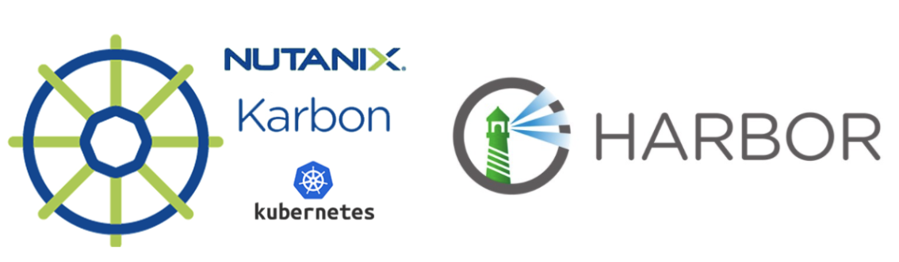
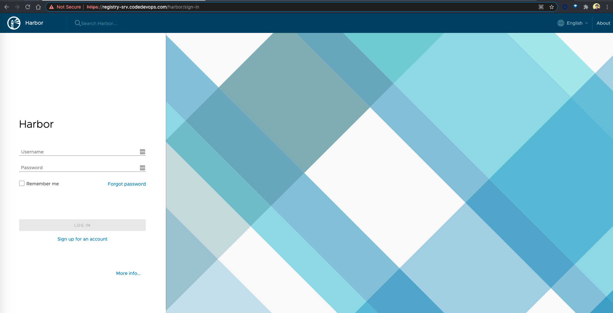
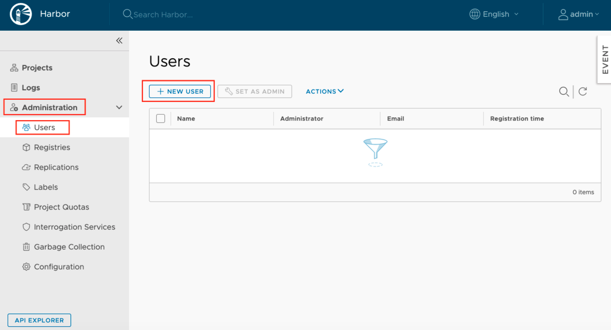
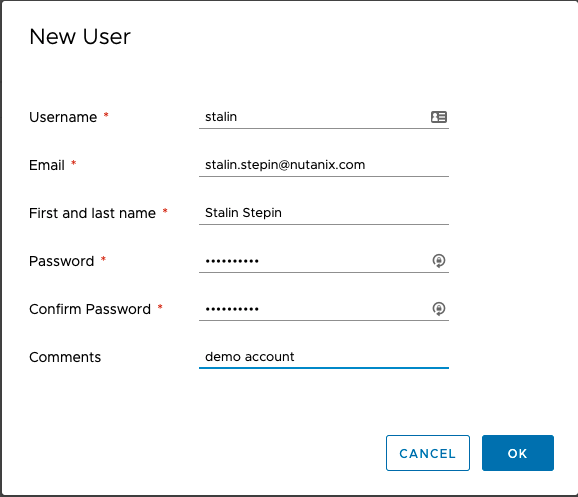
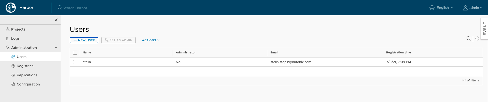
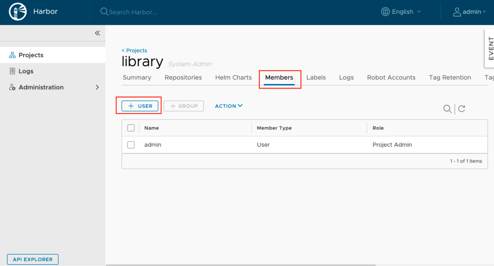
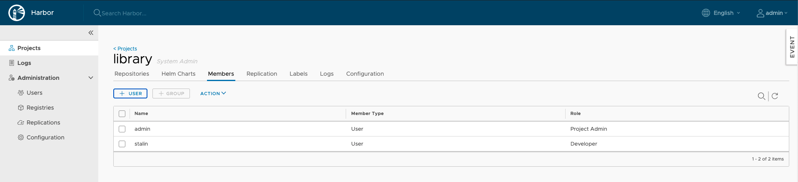
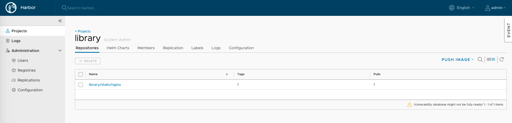

# Harbor + Karbon



## Introduction:

Harbor is a Private Registry solution which helps in managing and serving container images in secure environment. In production environments we tend to use private registry to have better control of the images and its security.

More details on how to setup Harbor with SSL certificate using openssl are discussed below. 


## Harbor Setup:
### Environment:

```shell
Distribution: Ubuntu 16.04 Desktop
fqdn: registry-srv.codedevops.com
```

### Install Docker:

```shell
stalin@registry-srv:~$ curl -fsSL https://download.docker.com/linux/ubuntu/gpg | sudo apt-key add -
stalin@registry-srv:~$ sudo add-apt-repository "deb [arch=amd64] https://download.docker.com/linux/ubuntu $(lsb_release -cs) stable"
stalin@registry-srv:~$ sudo apt-get update
stalin@registry-srv:~$ sudo apt-get install -y docker-ce

```

Verify Docker service state

```shell
sudo systemctl status docker --no-pager -l
```

Example output:

```shell
● docker.service - Docker Application Container Engine
   Loaded: loaded (/lib/systemd/system/docker.service; enabled; vendor preset: enabled)
   Active: active (running) since Fri 2020-04-10 20:49:29 IST; 2min 27s ago
     Docs: https://docs.docker.com
 Main PID: 4315 (dockerd)
   CGroup: /system.slice/docker.service
           └─4315 /usr/bin/dockerd -H fd:// --containerd=/run/containerd/containerd.sock
```

### Download docker-compose binary

```shell
stalin@registry-srv:~$ sudo curl -L "https://github.com/docker/compose/releases/download/1.25.5/docker-compose-$(uname -s)-$(uname -m)" -o /usr/local/bin/docker-compose
stalin@registry-srv:~$ sudo chmod +x /usr/local/bin/docker-compose
stalin@registry-srv:~$ sudo ln -s /usr/local/bin/docker-compose /usr/bin/docker-compose
```

### Setup Certificates

Create a staging directory first to organize the certificates

```shell
stalin@registry-srv:~$ mkdir ~/harbor_certs/
stalin@registry-srv:~$ cd ~/harbor_certs/
```

Create CA

```shell
stalin@registry-srv:~$ openssl genrsa -out ca.key 4096
stalin@registry-srv:~$ openssl req -x509 -new -nodes -sha512 -days 3650 \
 -subj "/C=IN/ST=Kerala/L=Chalakudy/O=demo/OU=Personal/CN=ca.codedevops.com" \
 -key ca.key \
 -out ca.crt
```

Create SSL extension file

```shell
stalin@registry-srv:~$ cat > v3.ext <<-EOF
authorityKeyIdentifier=keyid,issuer
basicConstraints=CA:FALSE
keyUsage = digitalSignature, nonRepudiation, keyEncipherment, dataEncipherment
extendedKeyUsage = serverAuth
subjectAltName = @alt_names

[alt_names]
DNS.1=codedevops.com
DNS.2=registry-srv.codedevops.com
DNS.3=registry-srv
EOF
```

Create a Certificate Signing Request(CSR) for Harbor’s nginx service

```shell
stalin@registry-srv:~$ openssl genrsa -out registry-srv.codedevops.com.key 4096
stalin@registry-srv:~$ openssl req -sha512 -new \
    -subj "/C=IN/ST=Kerala/L=Chalakudy/O=demo/OU=Personal/CN=registry-srv.codedevops.com" \
    -key registry-srv.codedevops.com.key \
    -out registry-srv.codedevops.com.csr
```

Generate and Sign Certificates

```shell
stalin@registry-srv:~$ openssl x509 -req -sha512 -days 3650 \
    -extfile v3.ext \
    -CA ca.crt -CAkey ca.key -CAcreateserial \
    -in registry-srv.codedevops.com.csr \
    -out registry-srv.codedevops.com.crt
```

After signing , we will get output like below

```shell
Signature ok
subject=/C=IN/ST=Kerala/L=Chalakudy/O=demo/OU=Personal/CN=registry-srv.codedevops.com
Getting CA Private Key
```

Create certificate directory for harbor

```shell
stalin@registry-srv:~$ sudo mkdir -p /data/cert/
stalin@registry-srv:~$ sudo cp  registry-srv.codedevops.com.crt registry-srv.codedevops.com.key /data/cert/
```

### Download Harbor offline installer.

```shell
stalin@registry-srv:~$ sudo curl https://storage.googleapis.com/harbor-releases/release-1.7.0/harbor-offline-installer-v1.7.1.tgz -O
stalin@registry-srv:~$ tar -xvf harbor-offline-installer-v1.7.1.tgz
```

Configure Harbor

```shell
stalin@registry-srv:~$ cd harbor
stalin@registry-srv:~$ sudo sed -i 's/hostname = reg.mydomain.com/hostname = registry-srv.codedevops.com/' harbor.cfg
stalin@registry-srv:~$ sudo sed -i 's/ssl_cert = \/data\/cert\/server.crt/ssl_cert = \/data\/cert\/registry-srv.codedevops.com.crt/' harbor.cfg
stalin@registry-srv:~$ sudo sed -i 's/ssl_cert_key = \/data\/cert\/server.key/ssl_cert_key = \/data\/cert\/registry-srv.codedevops.com.key/' harbor.cfg
stalin@registry-srv:~$ sudo sed -i 's/ui_url_protocol = http/ui_url_protocol = https/' harbor.cfg
```

Install Harbor & Start Harbor.

```shell
stalin@registry-srv:~$ sudo ./install.sh --with-notary --with-clair --with-chartmuseum
```

You should be able to see a successful reposnse as such:

```shell
[Step 0]: checking installation environment ...

Note: docker version: 20.10.7

Note: docker-compose version: 1.25.5

[Step 1]: loading Harbor images ...
Loaded image: goharbor/registry-photon:v2.6.2-v1.7.1
Loaded image: goharbor/harbor-migrator:v1.7.1
Loaded image: goharbor/harbor-adminserver:v1.7.1
Loaded image: goharbor/harbor-core:v1.7.1
Loaded image: goharbor/harbor-log:v1.7.1
Loaded image: goharbor/harbor-jobservice:v1.7.1
Loaded image: goharbor/notary-server-photon:v0.6.1-v1.7.1
Loaded image: goharbor/clair-photon:v2.0.7-v1.7.1
Loaded image: goharbor/harbor-portal:v1.7.1
Loaded image: goharbor/harbor-db:v1.7.1
Loaded image: goharbor/redis-photon:v1.7.1
Loaded image: goharbor/nginx-photon:v1.7.1
Loaded image: goharbor/harbor-registryctl:v1.7.1
Loaded image: goharbor/notary-signer-photon:v0.6.1-v1.7.1
Loaded image: goharbor/chartmuseum-photon:v0.7.1-v1.7.1


[Step 2]: preparing environment ...
Generated and saved secret to file: /data/secretkey
Generated configuration file: ./common/config/nginx/nginx.conf
Generated configuration file: ./common/config/adminserver/env
Generated configuration file: ./common/config/core/env
Generated configuration file: ./common/config/registry/config.yml
Generated configuration file: ./common/config/db/env
Generated configuration file: ./common/config/jobservice/env
Generated configuration file: ./common/config/jobservice/config.yml
Generated configuration file: ./common/config/log/logrotate.conf
Generated configuration file: ./common/config/registryctl/env
Generated configuration file: ./common/config/core/app.conf
Generated certificate, key file: ./common/config/core/private_key.pem, cert file: ./common/config/registry/root.crt
Copying sql file for notary DB
Generated certificate, key file: ./cert_tmp/notary-signer-ca.key, cert file: ./cert_tmp/notary-signer-ca.crt
Generated certificate, key file: ./cert_tmp/notary-signer.key, cert file: ./cert_tmp/notary-signer.crt
Copying certs for notary signer
Copying notary signer configuration file
Generated configuration file: ./common/config/notary/signer-config.postgres.json
Generated configuration file: ./common/config/notary/server-config.postgres.json
Copying nginx configuration file for notary
Generated configuration file: ./common/config/nginx/conf.d/notary.server.conf
Generated and saved secret to file: /data/defaultalias
Generated configuration file: ./common/config/notary/signer_env
Generated configuration file: ./common/config/clair/postgres_env
Generated configuration file: ./common/config/clair/config.yaml
Generated configuration file: ./common/config/clair/clair_env
Create config folder: ./common/config/chartserver
Generated configuration file: ./common/config/chartserver/env
The configuration files are ready, please use docker-compose to start the service.


[Step 3]: checking existing instance of Harbor ...


[Step 4]: starting Harbor ...
Creating network "harbor_harbor" with the default driver
Creating network "harbor_harbor-clair" with the default driver
Creating network "harbor_harbor-notary" with the default driver
Creating network "harbor_harbor-chartmuseum" with the default driver
Creating network "harbor_notary-sig" with the default driver
Creating harbor-log ... done
Creating registryctl        ... done
Creating redis              ... done
Creating registry           ... done
Creating harbor-db          ... done
Creating harbor-adminserver ... done
Creating harbor-core        ... done
Creating chartmuseum        ... done
Creating harbor-jobservice  ... done
Creating harbor-portal      ... done
Creating notary-signer      ... done
Creating clair              ... done
Creating nginx              ... done
Creating notary-server      ... done

✔ ----Harbor has been installed and started successfully.----

Now you should be able to visit the admin portal at https://registry-srv.codedevops.com.
For more details, please visit https://github.com/goharbor/harbor .
```

Also , you can use docker-compose to verify the health of containers


```shell
stalin@registry-srv:~$ sudo docker-compose ps
      Name                     Command                  State                                      Ports
---------------------------------------------------------------------------------------------------------------------------------------
chartmuseum         ./docker-entrypoint.sh           Up (healthy)   9999/tcp
clair               ./docker-entrypoint.sh           Up (healthy)   6060/tcp, 6061/tcp
clair-adapter       /clair-adapter/clair-adapter     Up (healthy)   8080/tcp
harbor-core         /harbor/harbor_core              Up (healthy)
harbor-db           /docker-entrypoint.sh            Up (healthy)   5432/tcp
harbor-jobservice   /harbor/harbor_jobservice  ...   Up (healthy)
harbor-log          /bin/sh -c /usr/local/bin/ ...   Up (healthy)   127.0.0.1:1514->10514/tcp
harbor-portal       nginx -g daemon off;             Up (healthy)   8080/tcp
nginx               nginx -g daemon off;             Up (healthy)   0.0.0.0:4443->4443/tcp, 0.0.0.0:80->8080/tcp, 0.0.0.0:443->8443/tcp
notary-server       /bin/sh -c migrate-patch - ...   Up
notary-signer       /bin/sh -c migrate-patch - ...   Up
redis               redis-server /etc/redis.conf     Up (healthy)   6379/tcp
registry            /home/harbor/entrypoint.sh       Up (healthy)   5000/tcp
registryctl         /home/harbor/start.sh            Up (healthy)
```

You should be able to now access the Harbor UI by using the following link: [https://registry-srv.codedevops.com](https://registry-srv.codedevops.com). Ensure DNS/host file entries are made. Else, use the IP address of the Harbor registry server as such: [https://10.60.99.82](https://10.60.99.82).

**NOTE:** **Punch in the IP address that you have used for your setup. The above IP is what I have used in my setup.**


You will be presented with the login page as such:



### Login and Configuration:

The default username and password is:

```shell
username: admin
password: Harbor12345
```

We shall now create a new user and then we will add that user to the default public project on Harbor.

Create User:



Fill the user details and set password for the account:



Once you click on `OK` you should be able to list the user.




Add user to the library project.


From there, click on `Members` and then selects `+Users`.



Give the user Developer Role and click on `OK`. You should be able to see the user added to the list:



Going forward we can use this account to push images to private registry.

### Client Certificates

With the already generated CA certificate, we will generate docker client certificates to use with Karbon Kubernetes cluster. So login back to your Harbor server again and move to the directory where the CA certificates are present. In our case:

```shell
stalin@registry-srv:~$ cd ~/harbor_certs/
```

Generate a CSR for docker and get it signed for the client

```shell
stalin@registry-srv:~$ openssl genrsa -out docker-client.codedevops.com.key 4096
stalin@registry-srv:~$ openssl req -sha512 -new \
    -subj "/C=IN/ST=Kerala/L=Chalakudy/O=demo/OU=Personal/CN=docker-client.codedevops.com" \
    -key docker-client.codedevops.com.key \
    -out docker-client.codedevops.com.csr
```

Sign Certificates

```shell
stalin@registry-srv:~$ openssl x509 -req -sha512 -days 3650 \
    -extfile v3.ext \
    -CA ca.crt -CAkey ca.key -CAcreateserial \
    -in docker-client.codedevops.com.csr \
    -out docker-client.codedevops.com.crt
```

You will get an output like below:

```shell
Signature ok
subject=/C=IN/ST=Kerala/L=Chalakudy/O=demo/OU=Personal/CN=docker-client.codedevops.com
Getting CA Private Key
```

Docker needs the certificate in PEM format , so lets convert the client certificate.

```shell
stalin@registry-srv:~$ openssl x509 -inform PEM -in docker-client.codedevops.com.crt -out docker-client.codedevops.com.cert
```

From here, copy the below files to the PC VM:

```shell
nutanix@NTNX-10-68-97-150-A-PCVM:~/k8s-harbor-registry.codedevops.com$ ls -ltr
total 16
-rw-r--r--. 1 nutanix nutanix 2037 Jul  3 16:08 ca.crt
-rw-r--r--. 1 nutanix nutanix 3243 Jul  3 16:08 docker-client.codedevops.com.key
-rw-r--r--. 1 nutanix nutanix 4188 Jul  3 19:15 docker-client.codedevops.com.cert
```

## Karbon Setup:

For the Karbon Kubernetes clusters to use the Harbor private registry, you need to first make Karbon aware that the registry is present and it can be accessed using the `IP address` or `FQDN` via the `karbonctl` command. To do this, follow the procedure below:

### Karbon Login:

You need to login to Karbon from CLI first to start using karbonctl on the PC VM:

```shell
nutanix@NTNX-10-68-97-150-A-PCVM:~$ cd karbon
nutanix@NTNX-10-68-97-150-A-PCVM:~/karbon$ ./karbonctl login --pc-username stalin.stepin@emeagso.lab
Please enter the password for the PC user: stalin.stepin@emeagso.lab
Login successful
```

### Karbon configuration:

Though Karbon supports basic and certificate based authentication, it does not support token based authentication yet. Unfortunately, docker uses token based authentication by default when making an API call to connect to private registry. Hence, unless we ask Karbon to skip this pre-check, the private registry addition task will continue to fail.

To skip this pre-check, you need to do the below:

```shell
nutanix@NTNX-10-68-97-150-A-PCVM:~$ sudo vim /home/docker/karbon_core/karbon_core_config.json
``` 

Add the following `"-skip-post-private-registry-prechecks"` to the entry_point section of the file:

```shell
"image": "karbon-core:v2.2.2",
"entry_point": [
        "/karbon",
        "-debug=true",
        "-v=4",
        "-logtostderr",
        "-skip-post-private-registry-prechecks"
```

Restart `karbon_core` docker container on PC VM to reflect the changes:

```shell
nutanix@NTNX-10-68-97-150-A-PCVM:~/karbon$ genesis stop karbon_core; cluster start
```

###Docker Client Certificate:

Next, you need to concatenate the `docker-client.codedevops.com.cert` with the `ca.crt` content as docker expects the complete chain. To do this, open `docker-client.codedevops.com.cert` and add `ca.crt` contents to it. The `docker-client.codedevops.com.cert` certificate should finally look like the below:

```shell
nutanix@NTNX-10-68-97-150-A-PCVM:~/k8s-harbor-registry.codedevops.com$ cat docker-client.codedevops.com.cert
-----BEGIN CERTIFICATE-----
MIIGBjCCA+6gAwIBAgIJALZm8SLBU8UoMA0GCSqGSIb3DQEBDQUAMHAxCzAJBgNV
BAYTAklOMQ8wDQYDVQQIDAZLZXJhbGExEjAQBgNVBAcMCUNoYWxha3VkeTENMAsG
A1UECgwEZGVtbzERMA8GA1UECwwIUGVyc29uYWwxGjAYBgNVBAMMEWNhLmNvZGVk
ZXZvcHMuY29tMB4XDTIxMDcwMzE0MDI0NloXDTMxMDcwMTE0MDI0NlowezELMAkG
A1UEBhMCSU4xDzANBgNVBAgMBktlcmFsYTESMBAGA1UEBwwJQ2hhbGFrdWR5MQ0w
CwYDVQQKDARkZW1vMREwDwYDVQQLDAhQZXJzb25hbDElMCMGA1UEAwwcZG9ja2Vy
LWNsaWVudC5jb2RlZGV2b3BzLmNvbTCCAiIwDQYJKoZIhvcNAQEBBQADggIPADCC
AgoCggIBAMN+bt95u4ma9LTUTIwRlyvBF05nmRfifQNTWOlbY2Woy13XPygC5EK/
Erf28P7CR7xsppg5i1jUTVFd4jAAPhI2eoECPsAWwONJhmnF+2iklw8HyUhru5C2
Iz/uotFbpkW3ozQAjvYfwbRDXLyCK3hfSCR3pKpl7dSGS/Q5CN35pg79lZbGn51i
7FbkSechIyV0Nq86jHksf0gtG01TtdNil4INzX7tBs8zoH4ISDi0SFdtaudxeQnp
Uxsnidj7mrcgP3Myv6DJAObAlu9P1KHkOi/5oo0D9Lc3xG6kL5tirs27T2aaPqQV
0jkHlpUcVBbLXTa23i1ac6bG1WASxL8dIqhMMyS4MyPAEDmjmgCuTIvOAlSwM7j0
ZkS8tRnLzV07wttWtDPuOXgwhkdCpm4wO5LiHL4MEJd1Ygc3Tdyj/2TzX2mqVRmJ
VH9qBHx9k89YBVm20pa6ojoHkYB6InHpma73YwYggJ985v82rJZSNUpYCHiCRSfG
SVXV5K/HnlcQpxAv2S+5uAG4+HA3q3s8sEMTUmgDUT4TrIiq5QOF0mx/SYhpFQj9
oOzbJfAfWq4LPOdkoN+tkhSqxNHqXnXkSOTdWrKI3yH0D4YiGRial7v061BHxj8E
qHcajZLMGmLp86eYWUBBlQJg8k4R9Pl6YrvmJnFiXXVqInqTN5EFAgMBAAGjgZcw
gZQwHwYDVR0jBBgwFoAUTWWR+U+lj1J5n3S6Kukwrd4D5acwCQYDVR0TBAIwADAL
BgNVHQ8EBAMCBPAwEwYDVR0lBAwwCgYIKwYBBQUHAwEwRAYDVR0RBD0wO4IOY29k
ZWRldm9wcy5jb22CG3JlZ2lzdHJ5LXNydi5jb2RlZGV2b3BzLmNvbYIMcmVnaXN0
cnktc3J2MA0GCSqGSIb3DQEBDQUAA4ICAQA3Ap0CNrPBUhgm47ZqelaRa97TMxSp
3oJxroGhVybIz7pxeQADjabQn9qKtcBD8hzkPyWSoCqbMaKjSV+V5IiQPHebMRXV
8N7eO0yAEoe8+bDHW0pTuUW+bEZYFcqklx5hZUwGKQdblsP61ucL2bSKv8Ey67fS
jCR+grlCFrpqldUu3JqLTCOTtPGX7OO5oBQPKOOaQx4lFG6XdJSrnVcRBmz9fMfn
tZ1hSJegTWUC5SLDoNh7sDze+jtEi3zHP1aZgaZlQcm/bt8IrXGZ53M+8hKFQQb1
zn4bQWlIIRDb+d48WrMbu2KDU8f10OxFekOTqj68KDozxZJeYLIop2jY+jF/eLtm
qCWutev5OSqoYASibMHB0eW9ZB2T+fooqrpUNpcnVPySsCwmEt8+nOU1HqEYTLtR
Z+JlzFClivSMa7IVafAkGReiqideNB02tWv0QiH302hb4e72g+EGtjxPJHGxrLUF
+NUrpE1IjooTp+xRjAiaeXvQjrqCmlVbLvnno9xFDGpn+KpY907hztq/eoPbQnlN
ewu1hbYu/Pe1eVfvYN7lksKJUlFOaENG7xDHmfaPgHCf5s82mG4hbzFFLYD6eUNX
IlILIczCIfrKy46nDQsPryMrw6Xt3YUkJ/l4JiWw2RBkmfZ0GNtKbCgBdNslq0Sj
fDpZqyIz/zB+ww==
-----END CERTIFICATE-----
-----BEGIN CERTIFICATE-----
MIIFszCCA5ugAwIBAgIJAPO1cQX+QQe8MA0GCSqGSIb3DQEBDQUAMHAxCzAJBgNV
BAYTAklOMQ8wDQYDVQQIDAZLZXJhbGExEjAQBgNVBAcMCUNoYWxha3VkeTENMAsG
A1UECgwEZGVtbzERMA8GA1UECwwIUGVyc29uYWwxGjAYBgNVBAMMEWNhLmNvZGVk
ZXZvcHMuY29tMB4XDTIxMDcwMzEzMTExOVoXDTMxMDcwMTEzMTExOVowcDELMAkG
A1UEBhMCSU4xDzANBgNVBAgMBktlcmFsYTESMBAGA1UEBwwJQ2hhbGFrdWR5MQ0w
CwYDVQQKDARkZW1vMREwDwYDVQQLDAhQZXJzb25hbDEaMBgGA1UEAwwRY2EuY29k
ZWRldm9wcy5jb20wggIiMA0GCSqGSIb3DQEBAQUAA4ICDwAwggIKAoICAQDLF9/J
xei29ndhpi9zeedZs8HXFefjWj03GqDBstS4afirpUP3DIiC/G0N7AQezeL2btCj
KNp3iluGmKeT5SZ+f7im1rTAx7Svf2osMlPT2rWtpmgvOopylmoEjpPNrCKUkWYU
J7fn+xKlOltcQJHTqH5tWNTD2cd6VUBl+x/5xJB+s3ywx4gc2cCljYFBx5cm6XKR
jvo5p1b2brmj2vb7M5rhwwCMj6kjlHAD42CX1VL1Kbr8DP2uyKtwPXBa8W79foR5
+w1VrQytyHYnxjWfGVnRjGzsMHKqXscTmrOPjPMg0qQQM6MhMzwkwZPZ+5dm0fR5
ulK1QvcSCfytN4W2/Frtl4ob5C2/MxtGBiIecrw4IXarQdBNoPnCYcbTx3sok/RN
pteycsB3ZmbkHPX/YRc3qvGXAyKZfjDfgT+ICcXZRjL6OBw7fTS+lJkCfhZq6wCV
aU/L92zNinQ+ksQ84LeY234M4iEZsshDXQ1zo1K/FFhVGS+M0pG3Wa23ZHm8+Niu
xxIdL0O1f3am3n6jzHVH4bI9QkFA5T8skrhLuS9ZwKC8F6sjYuN7b+zEjHx+wdwX
x84kfSPD5dmsqQCv2w0H4I5GezEnE2pMqJXf4PpVJjX8KoctWNb58R4nWiFJRf1h
ojdT5KkYLQQFo32JUChdK2A94vBd6zuzadNzTQIDAQABo1AwTjAdBgNVHQ4EFgQU
TWWR+U+lj1J5n3S6Kukwrd4D5acwHwYDVR0jBBgwFoAUTWWR+U+lj1J5n3S6Kukw
rd4D5acwDAYDVR0TBAUwAwEB/zANBgkqhkiG9w0BAQ0FAAOCAgEAEft1uBGR29IX
vueaH3zerDZUVKiAwIIYw5s+DurVusOuvEJ9BaBAn8+L8KJJ5MSlKM+0n97IxD33
RN1rN1l+hIuFxQ51hkNLrdVcC1fyyCXvOYagmsjxXi8i7HpbelJpB1AFJquOl/OC
/f40rIYlYyyp01dX5QiYht70jDXPp/QqbryUZZY2nLXb7J9zth9/wDOxsH4YjyfY
jCmapvGB7Qc7Q2o6b0nK1ADZjhympM7xkRL87D/l2ceOEDifaKWfSsS2MfEmJEWR
fllgAFyh46ykbEiTUe5Ngit3oVg/zmhrR41BZ8UOpc0cwNt1Ka+yh7NEmxzQpd92
v5FvraCPBcPjefQ5gj8G0c+8Waw8njVgV0pyR28Rt94WarUPunrtjSayQ1r8xohP
W6FMLJ124RLB6kvCUsvjqfypnFJMaSkoBANdmE7SthijUFC3t/v4xemUeejGFChI
+shMCUqWeXj+JbKkwWSbmGNd0JTgNwTf5KNTKTJQ6xZ4IFqp7aUXyI6pV6oYC2UT
zI/bRbwkTbn8fEaf/H2qD6FUFIpu4BzJ3+OcPvc+K1YGkgbI6/Wg1WIEcDRpNzsY
mH0IOcHjqDqAqX2G7eUCC/BZfbuGkQk8ra/oMGyt4VtXtmb9QxzGQyHL64d51vhR
4C4Tlxctd3W1FxrsAqtYS7BHuhgoaRc=
-----END CERTIFICATE-----
``` 

### Harbor configuration with Karbon

You should now have everything to configure the Harbor private registry with Karbon. Simply fire the below command to add private registry with Karbon:

```shell
nutanix@NTNX-10-68-97-150-A-PCVM:~/karbon$ ./karbonctl registry add --name harbor --url registry-srv.codedevops.com --username admin --password Harbor12345 --cert-file /home/nutanix/k8s-harbor-registry.codedevops.com/docker-client.codedevops.com.cert
Successfully add private registry to Karbon: [POST /karbon/v1-alpha.1/registries][202] postPrivateRegistryAccepted  &{Endpoint:0xc000516050 Name:0xc000516070 UUID:0xc000516080}
```

Verify, if the addition was successful:

```shell
nutanix@NTNX-10-68-97-150-A-PCVM:~/karbon$ ./karbonctl registry list
Name      UUID                                    Endpoint
harbor    ae213544-5a16-44d7-760c-d1aa46639e1e    registry-srv.codedevops.com
```

You need to now integrate the Karbon Kubernetes cluster with Harbor registry using the below method:

```shell
nutanix@NTNX-10-68-97-150-A-PCVM:~/karbon$ ./karbonctl cluster registry add --cluster-name stalin-k8s-1 --registry-name harbor
Successfully submitted request to add private registry config "harbor" to k8s cluster "stalin-k8s-1": Task UUID: 951ee151-a946-4173-8df3-9c9d4734f7c2
```

### Docker image operation on Harbor

For the k8s cluster to consume docker image, you need to push images to the docker private registry. To do this you must be first authenticated with the Harbon private registry. 

Login to Harbor private registry from development machine which has internet access:


```shell
[stalin@devbox ~]$ sudo docker login registry-srv.codedevops.com
Username: stalin
Password:
WARNING! Your password will be stored unencrypted in /root/.docker/config.json.
Configure a credential helper to remove this warning. See
https://docs.docker.com/engine/reference/commandline/login/#credentials-store

Login Succeeded
``` 

Pull nginx docker image from the internet using the below command:

```shell
[stalin@devbox ~]$ docker pull nginx
Using default tag: latest
Got permission denied while trying to connect to the Docker daemon socket at unix:///var/run/docker.sock: Post http://%2Fvar%2Frun%2Fdocker.sock/v1.39/images/create?fromImage=nginx&tag=latest: dial unix /var/run/docker.sock: connect: permission denied
[nutanix@karbon-stalin-k8s-1-088899-k8s-master-0 ~]$ sudo docker pull nginx
Using default tag: latest
latest: Pulling from library/nginx
b4d181a07f80: Pull complete
edb81c9bc1f5: Pull complete
b21fed559b9f: Pull complete
apiVersion: v1
03e6a2452751: Pull complete
b82f7f888feb: Pull complete
5430e98eba64: Pull complete
Digest: sha256:47ae43cdfc7064d28800bc42e79a429540c7c80168e8c8952778c0d5af1c09db
Status: Downloaded newer image for nginx:latest
```

Tag the downloaded image with the harbor private registry details:

```shell
[stalin@devbox ~]$ sudo docker tag nginx:latest registry-srv.codedevops.com/library/stalin/nginx:latest
```

Push the image to Harbor private registry:

```shell
[stalin@devbox ~]$ sudo docker push registry-srv.codedevops.com/library/stalin/nginx
The push refers to repository [registry-srv.codedevops.com/library/stalin/nginx]
c6d74dcb7fe7: Pushed
b50a193ebf2e: Pushed
165eb6c3c0d3: Pushed
cf388fcf3527: Pushed
2418679ca01f: Pushed
764055ebc9a7: Pushed
latest: digest: sha256:2f1cd90e00fe2c991e18272bb35d6a8258eeb27785d121aa4cc1ae4235167cfd size: 1570
```

You would be able to see this image on Harbor private registry:



You should be ready to consume this image with Karbon k8s cluster.

### Harbor configuration inside k8s cluster:

For docker to start using the Harbor private registry in a secure manner and pull images, you need to create a `docker-registry` secret within Kubernetes. To do this run the below command on the k8s master node:

```shell
[nutanix@karbon-stalin-k8s-1-088899-k8s-master-0 ~]$ kubectl create secret docker-registry regcred --docker-server=registry-srv.codedevops.com --docker-username=stalin --docker-password=Nutanix/4u
secret/regcred created
```
You are all set to start using images from Harbor private registry. All that's left is to use the image with the pod manifest file as below: 

```shell
[nutanix@karbon-stalin-k8s-1-088899-k8s-master-0 ~]$ cat nginx.yaml
apiVersion: v1
kind: Pod
metadata:
  name: nginx-priv
spec:
  containers:
  - name: nginx-priv-container
    image: registry-srv.codedevops.com/library/stalin/nginx
  imagePullSecrets:
  - name: regcred
```

Run the `kubectl create` command to create the pod:

```shell
[nutanix@karbon-stalin-k8s-1-088899-k8s-master-0 ~]$ kubectl create -f nginx.yaml
pod/nginx-priv created
```

You would shortly see the pod in `Running` state:

```shell
[nutanix@karbon-stalin-k8s-1-088899-k8s-master-0 ~]$ kubectl get pods
NAME                      READY   STATUS    RESTARTS   AGE
nginx-priv                1/1     Running   0          5s
nginx3-6f86f99744-n2s4j   1/1     Running   0          8d
```
